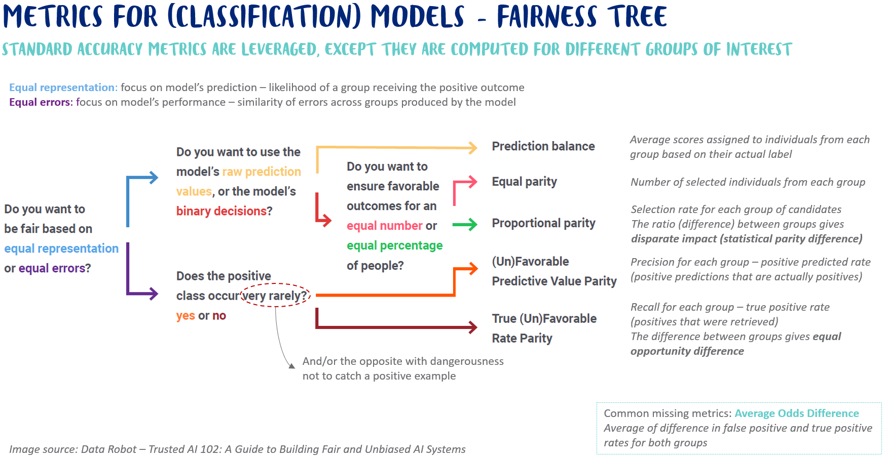

# Welcome to the project Ethical AI Toolkit


- **Project name**: Ethical AI Toolkit
- **Library name**: ethicalai
- **Authors**: Datcraft, Ekimetrics, Danone
- **Description**: Open source Ethical AI toolkit

This project aims at leveraging and improving existing AI fairness initiatives. More to come... Meanwhile, below is a
little reminder about main fairness metrics.



## Project Structure
```
- ethicalai/ # Your python library
- data/
    - raw/
    - processed/
- docs/
- tests/                            # Where goes each unitary test in your folder
- scripts/                          # Where each automation script will go
- requirements.txt                  # Where you should put the libraries version used in your library
```


